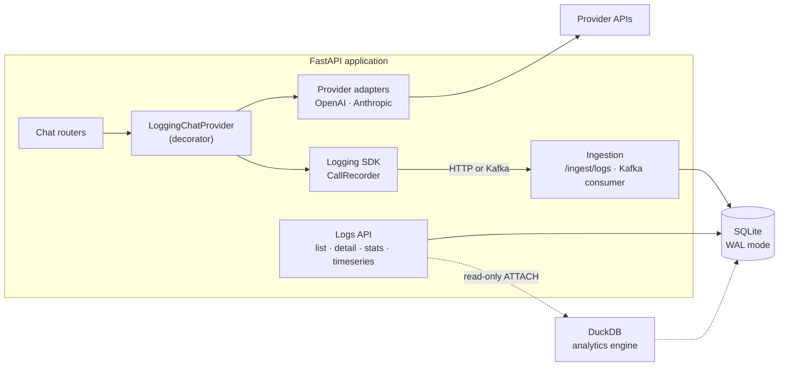
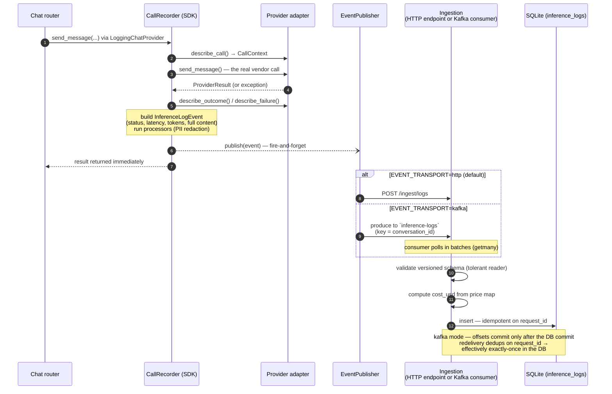
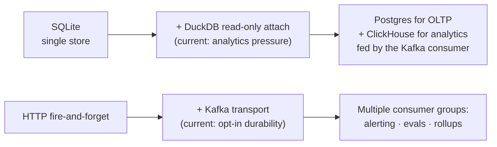

# InferenceLens

A lightweight LLM chat app, and the inference logging and analytics
pipeline behind it. The chat part is deliberately small — the pipeline is
the point.

Every model call — chat, streaming, or the background titling call;
success, error, or cancellation — produces exactly one structured
inference log with the full rendered prompt, the completion, token usage,
latency, cost, and failure details. Nothing relies on call sites
remembering to log: the only provider object the application can obtain
is already instrumented, so an unlogged call path doesn't exist.

## Highlights

**The chat application**

- **Multi-provider, multi-model** — OpenAI and Anthropic adapters behind
  a single `ChatProvider` interface; the model is selectable per message
  from a `GET /models` catalog, and adding a model is a one-line change.
- **Streaming responses** — assistant replies stream over SSE, and
  streamed calls record time-to-first-token into their inference logs.
- **Persistent conversations** — list past conversations by recency, open
  any of them, and continue where you left off; the model receives a
  sliding window of history, and titles are auto-generated in the
  background (itself a logged inference call).

**The observability pipeline**

- **Stats dashboard** — cost, latency percentiles (p50/p95/p99), token
  usage and throughput, error rates, and per-model/provider breakdowns,
  served by dedicated `/logs/stats` and `/logs/timeseries` endpoints and
  rendered as timeseries charts plus a filterable log explorer with
  full-prompt drill-down.
- **Event-driven architecture** — every log travels as a versioned event
  through an `EventPublisher` interface, over HTTP or Kafka. The broker
  adds durability (events survive ingestion downtime), replay,
  backpressure absorption, and fan-out to future consumers — and it was
  swapped in without touching a single call site.
- **PII redaction for production-grade logging** — emails, phone numbers,
  and other identifiers are scrubbed from log content *before* events
  leave the producing process, so sensitive data never crosses the wire
  or reaches the broker. That's the boundary a compliance review will
  ask about.
- **Per-call cost tracking** — `cost_usd` computed at ingestion from a
  versioned price map, stored so historical costs stay immutable when
  prices change.

Under the hood:

- **SDK-style automatic instrumentation** — a portable logging SDK
  (`app/logging_sdk/`) that wraps any provider through a small contract and
  emits versioned events with zero changes at call sites.
- **Pluggable everything** — providers, models, event transports,
  analytics engines (SQLAlchemy or DuckDB), and event processors are all
  swappable behind interfaces.
- **Operable by design** — idempotent ingestion, at-least-once delivery
  with dedup, fire-and-forget publishing that can never slow or break a
  chat request, and explicit failure containment at every boundary.



---

## Table of contents

- [Getting started](#getting-started)
- [Project structure](#project-structure)
- [Architecture](#architecture)
  - [Design principles](#design-principles)
  - [The logging SDK: automatic instrumentation](#the-logging-sdk-automatic-instrumentation)
  - [End-to-end ingestion flow](#end-to-end-ingestion-flow)
  - [Extensibility surfaces](#extensibility-surfaces)
  - [Failure handling](#failure-handling)
- [Data model](#data-model)
- [Component choices, and why](#component-choices-and-why)
- [API surface](#api-surface)
- [Tradeoffs and the scaling path](#tradeoffs-and-the-scaling-path)

---

## Getting started

### Prerequisites

- Python 3.12+ with [`uv`](https://docs.astral.sh/uv/) (backend package
  manager — no pip/venv/Poetry)
- Node.js 18+ with `npm` (frontend)
- An OpenAI API key (required). An Anthropic key is optional — without it
  the Anthropic models simply don't appear in the model picker.

### Install and run

```bash
make install-backend     # uv sync
make install-frontend    # npm install

cp backend/.env.example backend/.env     # add your OPENAI_API_KEY
cp frontend/.env.example frontend/.env

make db-upgrade          # apply Alembic migrations (fresh clone has no tables)

make backend             # http://localhost:8000  (Swagger UI at /docs)
make frontend            # http://localhost:5173
```

### Tests and lint

```bash
make test    # pytest — isolated in-memory SQLite per test; no services needed
make lint    # ruff
```

Tests never touch the dev database, network, or `.env` — the suite runs
cold on a fresh clone. Coverage focuses on the pipeline's structural
guarantees: the "exactly one log per call" recorder contract, idempotent
ingestion, consumer failure handling, provider response mapping, cost
computation, and redaction fail-open behavior.

### Kafka event pipeline (local dev, optional)

The default transport is HTTP (`EVENT_TRANSPORT=http`) — no broker
required, zero-infra. To run the durable pipeline locally (macOS,
KRaft mode, no ZooKeeper, no Docker):

```bash
brew install kafka
brew services start kafka        # listens on localhost:9092

# optional — the broker auto-creates topics on first publish
$(brew --prefix)/opt/kafka/bin/kafka-topics --create \
  --topic inference-logs --bootstrap-server localhost:9092 \
  --partitions 1 --replication-factor 1
```

Then set `EVENT_TRANSPORT=kafka` in `backend/.env` and restart
`make backend`. The FastAPI lifespan starts the in-app consumer
automatically; events now flow SDK → broker → consumer → database. The
same consumer also runs standalone (`make consumer`), which is how it
would run if ingestion were ever split into its own service.

Useful checks:

```bash
# watch raw events land on the topic
$(brew --prefix)/opt/kafka/bin/kafka-console-consumer \
  --bootstrap-server localhost:9092 --topic inference-logs --from-beginning

# replay the topic from the start — every event redelivers and gets
# skipped as a duplicate on request_id
$(brew --prefix)/opt/kafka/bin/kafka-consumer-groups \
  --bootstrap-server localhost:9092 --group ingestion \
  --topic inference-logs --reset-offsets --to-earliest --execute
```

Kill the broker mid-session and chat keeps working — publish failures log
at ERROR and the request is unaffected. That containment is deliberate;
see [Failure handling](#failure-handling).

### DuckDB analytics engine

On by default when `DATABASE_URL` points at a SQLite file
(`ANALYTICS_ENGINE=auto`). `GET /logs/stats` and `GET /logs/timeseries`
are answered by DuckDB attaching the live SQLite file **read-only** — no
second copy of the data, no sync job, no server process. Set
`ANALYTICS_ENGINE=sqlite` to force the legacy SQLAlchemy path (the
operational kill switch).

### Key configuration

All settings live in `backend/.env` (see `.env.example` for the full,
commented list). The ones that change behavior:

| Variable | Default | Effect |
|---|---|---|
| `OPENAI_API_KEY` | — | Required; app does not boot without it |
| `ANTHROPIC_API_KEY` | empty | Optional; enables Anthropic models in the catalog |
| `DEFAULT_CHAT_MODEL` | `gpt-5.6-terra` | Model used when a request omits `model` |
| `EVENT_TRANSPORT` | `http` | `http` posts to `/ingest/logs`; `kafka` produces to the topic |
| `ANALYTICS_ENGINE` | `auto` | `auto` / `sqlite` / `duckdb` for the stats endpoints |
| `REDACTION_ENABLED` | `true` | PII scrubbing of log content before it enters the pipeline |
| `DATABASE_URL` | `sqlite:///./app.db` | Any SQLAlchemy URL — Postgres is a config change, not a code change |

---

## Project structure

```
backend/
  app/
    main.py               # FastAPI app, lifespan, CORS, error handlers
    core/
      config.py           # pydantic-settings — every knob in one place
      observability.py    # composition root: builds publisher + recorder from settings
      pricing.py          # versioned static price map → cost_usd at ingestion
      redaction.py        # PII-scrubbing EventProcessor (scrubadub)
      errors.py           # exception → clean JSON translation
    db.py                 # SQLAlchemy engine (WAL + busy_timeout), sessions
    models.py             # ORM tables: conversations, messages, inference_logs
    schemas.py            # Pydantic request/response models
    routers/              # HTTP concerns only — one file per resource
    repositories/         # all SQLAlchemy queries — one class per resource
    providers/            # ChatProvider ABC, adapters, catalog, logging decorator
    logging_sdk/          # portable SDK — imports NOTHING from app.*
      contract.py         # InstrumentedProvider ABC, CallContext/Outcome/Failure
      events.py           # InferenceLogEvent (versioned), processor chain
      publisher.py        # EventPublisher ABC + HTTPEventPublisher
      kafka_publisher.py  # KafkaEventPublisher (aiokafka)
      recorder.py         # CallRecorder — the single event emission point
    ingestion/
      service.py          # build_log(): shared event → row logic (HTTP + Kafka paths)
      consumer.py         # batch Kafka consumer; also runs standalone via python -m
  alembic/                # migrations — the only schema-change path
  tests/
frontend/                 # React + Vite + TS: chat UI and a log dashboard
Makefile                  # every workflow is a make target
```

---

## Architecture

### Design principles

Four decisions shape most of what follows:

1. **Instrumentation is structural, not conventional.** The industry has
   four ways to capture LLM calls: explicit wrapper functions (opt-in, so
   coverage decays), monkey-patching (total coverage, fragile across SDK
   versions), proxies (zero code change, adds a network hop and an uptime
   dependency), and decorators substituted at a composition root.
   InferenceLens uses the decorator: `get_chat_provider()` is the **only**
   way to obtain a provider, it always returns a `LoggingChatProvider`,
   and the concrete adapters are not exported — `from app.providers import
   OpenAIProvider` does not work, by design. This buys monkey-patching's
   "every call is captured" guarantee without patching anything: the swap
   happens in one function this codebase owns.

2. **The SDK is host-agnostic by contract.** `app/logging_sdk/` imports
   the standard library, Pydantic, httpx, and aiokafka — never `app.*`.
   Configuration arrives as constructor arguments; provider knowledge
   arrives through an ABC the host implements. The package could be
   lifted into another codebase, or published, unchanged. The check is
   mechanical (`grep "from app\." backend/app/logging_sdk/` must be
   empty), so the boundary is easy to hold in code review.

3. **Adapters absorb provider variance.** Every vendor shapes responses
   differently (OpenAI's `usage.input_tokens` vs. Anthropic's
   `stop_reason` vs. anyone's error taxonomy). Each adapter normalizes
   its vendor's native API into a canonical `ProviderResult` and
   self-describes to the SDK through three abstract methods —
   `describe_call`, `describe_outcome`, `describe_failure`. The SDK never
   reaches into a vendor response or `isinstance`-checks an exception;
   everything on an event comes from what the adapter returned or from
   the SDK's own clock. A provider renaming a field touches exactly one
   adapter; the event schema, ingestion, and log table never notice.

4. **The event contract is the only coupling.** Producer and consumer
   share exactly one thing: the versioned `InferenceLogEvent` schema.
   Ingestion is a tolerant reader (unknown fields ignored), additive
   changes don't bump the version, and breaking changes do — which is
   what makes it safe to put a broker between the two sides, or to split
   ingestion into its own service, without a coordinated deploy.

### The logging SDK: automatic instrumentation

Application code makes an ordinary provider call and cannot tell the
instrumentation exists:

```python
provider: ChatProvider = Depends(get_chat_provider)
result = await provider.send_message(messages, system=..., model=..., ...)
```

Behind that call, `CallRecorder.invoke()` is the single emission point in
the entire codebase. Events are built in exactly one place, so "exactly
one log per call" holds without any call site having to think about it:

```
CallRecorder.invoke(adapter, call_type, **kwargs)
    t0 = now()
    context = adapter.describe_call(**kwargs)        # adapter self-describes
    try:     result  = adapter.send_message(**kwargs)  # the real vendor call
             outcome = adapter.describe_outcome(result)
    except:  failure = adapter.describe_failure(exc); re-raise
    finally: event = build(latency=now()-t0, context, outcome/failure, status)
             event = processor(event) for each EVENT_PROCESSORS   # e.g. PII redaction
             schedule publish(event)                 # fire-and-forget, never awaited
    return result                                    # untouched
```

A few things to note:

- **The event is assembled on every exit path** — success, provider
  error, and cancellation all produce a log with the right status.
- **Publishing is fire-and-forget** (`asyncio.create_task`, never
  awaited). The chat response never waits on logging, and a publish
  failure produces an ERROR line and a lost event — never a failed or
  slowed request. This is the one sanctioned "log and continue" zone in
  the codebase; everywhere else, swallowing exceptions is banned.
- **The processor chain runs producer-side.** PII redaction
  (`scrubadub`-based, on by default) scrubs `input_messages` and
  `output_text` *before* the event leaves the process, so sensitive
  content never crosses the wire or reaches the broker. Each field
  scrubs under its own guard and fails open to the original text,
  logged, rather than taking the pipeline down.

### End-to-end ingestion flow



Both transports converge on the same code: `build_log()` in
`app/ingestion/service.py` owns the event→row mapping and cost
computation, so an HTTP-ingested event and a Kafka-consumed one are
byte-identical in the database. The consumer commits offsets only after
the database commit for the batch; a crash in between causes redelivery,
which the `request_id` unique constraint absorbs — at-least-once delivery
plus idempotent writes yields effectively exactly-once storage.

Two ingestion decisions that are deliberate exceptions to this project's
own rules, confined to this boundary:

- `conversation_id` on a log is a **plain column, not a foreign key**,
  and is not parent-validated. Ingestion's contract is the event payload;
  it must accept events even when it knows nothing about the chat schema
  (the future standalone consumer won't share the app's tables).
- Logs store the **full rendered input and output, denormalized** — no
  references into the `messages` table. The log must be self-contained,
  the rendered prompt (system prompt + context window) is not
  reconstructable from any message row, and logs are immutable snapshots
  while app data can change. Content is stored roughly twice; that's
  managed later with retention and tiered storage (the Langfuse/LangSmith
  pattern), never by re-normalizing.

### Extensibility surfaces

Each change this design anticipates has its own seam. The table lists
what you'd touch, and what stays untouched:

| To add… | You touch | Everything else |
|---|---|---|
| **A provider** | One adapter file implementing `ChatProvider` (the ABC forces `describe_call/outcome/failure` — a missing mapping is a `TypeError` at instantiation, not a silent gap in the logs) + one `case` in `_build()` | SDK, event schema, ingestion, log table: unchanged |
| **A model** | One line in `MODEL_CATALOG` + a price-map entry | `GET /models`, per-message selection, cost: pick it up automatically |
| **A transport** | One `EventPublisher` implementation + one branch in the composition root (`app/core/observability.py`) | Call sites and the SDK core: unchanged — this is exactly how Kafka landed after HTTP |
| **An event processor** (redaction, sampling, enrichment) | One function appended to `EVENT_PROCESSORS` | The recorder runs it; nothing else knows |
| **A stream consumer** (alerting, evals, cost anomaly detection) | A new consumer group on the topic | Producer and app: unaware — fan-out is the broker's job |
| **A datastore** | `DATABASE_URL` (Postgres is a URL change) | Application code: unchanged |

Provider-specific response data that doesn't fit the canonical columns
lands in a `provider_metadata` JSON overflow — captured without schema
churn, and promoted to a real column only when a query pattern needs to
filter or aggregate on it (an additive migration).

### Failure handling

One rule runs through all of this: **observability must never take down
the thing it observes.** Containment is explicit at every boundary, and
each failure mode has a defined behavior:

| Failure | Behavior |
|---|---|
| Provider API error (rate limit, auth, 5xx) | Clean 502 JSON to the client; log stored with `status=error` + error class/message; the user's message is kept so they can retry |
| Publisher unreachable (HTTP transport) | ERROR log with event context; event dropped; chat request unaffected — v1 accepts loss, Kafka mode removes it |
| Broker down (Kafka transport) | App boots and serves regardless; publish failures log at ERROR; publishing resumes when the broker returns |
| Malformed message on the topic | Validated against the same schema as HTTP ingestion; ERROR log with topic/partition/offset; skipped, never retried forever, never crashes the loop (DLQ is recorded future work) |
| Duplicate event delivery | `request_id` unique constraint — HTTP path returns 409 (publisher treats as success), consumer path skips silently |
| Consumer crash between DB commit and offset commit | Batch redelivers on restart; every row dedups; offsets then commit |
| A `describe_*` or processor raises | Guarded inside the recorder; ERROR log; the call's result still returns untouched |
| PII redaction failure | Fails open per field — original text kept, ERROR logged with `request_id`; one bad detector never loses an event |
| Auto-titling failure | Title stays default; an `error`-status log with `call_type=title` records it; the chat turn is unaffected |
| DuckDB attach/query failure | **Not** swallowed — 500 with context logged (`never swallow exceptions` applies outside the logging path); `ANALYTICS_ENGINE=sqlite` is the operator's kill switch |

---

## Data model

Three tables: `conversations`, `messages`, and `inference_logs`, where
most of the design decisions live. The log schema's choices and the
reasoning behind them:

| Design choice | Why |
|---|---|
| Canonical columns use **OTel GenAI naming** (`input_tokens`, `output_tokens`, model/provider attributes) | The schema speaks the emerging standard vocabulary; logs stay comparable with serving-side dashboards |
| `request_id` unique constraint | The idempotency key that makes at-least-once delivery safe — a DB-level invariant, not an application-level check-then-act |
| `cost_usd` computed **at ingestion** from a versioned price map, and stored | Cost is immutable even when prices change later; unknown models yield `null`, never a rejection |
| `config_hash` over (provider, model, system prompt, params) | Groups calls made with an identical configuration — "did the new prompt version get slower or costlier?" is one GROUP BY |
| `time_to_first_token_ms`, populated by the SSE streaming path | TTFT + latency + tokens is the metric trio serving systems (vLLM et al.) standardize on; throughput (tokens/sec) is **derived at read time** from raw measurements so denormalized rates can never drift |
| `provider_metadata` JSON overflow | Provider extras (cache tokens, stop reasons, model fingerprints) captured without migrations |
| `schema_version` on every event | The producer/consumer contract survives a broker in the middle — events published before a deploy are consumed after it |

Indexes follow the actual query patterns: `request_id` (point lookup),
`(created_at)` (activity tail), `(conversation_id, created_at)` (trace a
conversation), `(status, created_at)` (error triage).

---

## Component choices, and why

| Component | Role | Why this one |
|---|---|---|
| **FastAPI + Pydantic v2** | API layer, validation, DI | Typed request/response schemas at every boundary (no raw dicts cross the API), native async for fire-and-forget publishing and SSE streaming, and `Depends` is how the instrumented provider reaches request handlers |
| **SQLAlchemy 2.0 + Alembic** | ORM + migrations | Migrations are the only schema-change path; `DATABASE_URL` is the single source of truth, so SQLite→Postgres is config, not code |
| **SQLite (WAL mode)** | The single datastore | One store serves both the transactional chat tables and the append-only logs, with zero ops at this scale. WAL + busy-timeout went in once there were concurrent writers (request handlers, titling tasks, the Kafka consumer) and an out-of-band reader (DuckDB) |
| **Kafka (`aiokafka`)** | Durable event transport (opt-in) | Decouples producer from ingestion, absorbs bursts, enables replay and future fan-out (alerting, evals) from the same stream. `aiokafka` over `confluent-kafka` because it's asyncio-native and fits the FastAPI event loop; librdkafka's throughput edge is irrelevant at this volume. Opt-in on purpose: the default HTTP transport keeps the app zero-infra |
| **DuckDB** | Columnar analytics engine | Handles the aggregate queries that were starting to outgrow the row store, without adding a second datastore: it attaches the live SQLite file read-only and computes percentiles + timeseries in single-pass SQL (the old path ran one query per percentile and bucketed timeseries in Python). No server, no copy of the data, no new write path |
| **scrubadub** | PII redaction processor | Producer-side scrubbing at the SDK boundary — content is clean before it crosses any wire; fails open per field so redaction can never lose an event |
| **uv / npm / Make** | Toolchain | One entry point per workflow; no Docker, no manual venvs — a fresh clone is running in four commands |
| **React + Vite + TS** | Chat UI + log dashboard | Deliberately thin; every endpoint gets a typed function in `src/api.ts` mirroring backend schema names so drift is visible |

The architecture mirrors the pipeline the established observability
players converged on (Langfuse, LangSmith, Helicone, OpenLLMetry):
**instrument → ingest/validate → buffer → process → store → query** — at
a footprint where each stage can grow independently.

---

## API surface

Every endpoint declares a Pydantic request schema and `response_model`;
list endpoints paginate (`limit`/`offset` with a `Page[T]` envelope).

| Method | Path | Purpose |
|---|---|---|
| `POST` | `/conversations` | Create a conversation |
| `GET` | `/conversations` | List conversations (by recency) |
| `GET` | `/conversations/{id}` | Get one conversation |
| `POST` | `/conversations/{id}/messages` | Send a message, get the assistant reply |
| `POST` | `/conversations/{id}/messages/stream` | Same, streamed over SSE (captures TTFT) |
| `GET` | `/conversations/{id}/messages` | List messages (chronological) |
| `GET` | `/models` | Model catalog — entries whose provider key is configured |
| `POST` | `/ingest/logs` | Ingest an inference event (SDK-facing; idempotent) |
| `GET` | `/logs` | List logs — filters: conversation, status, call type, model, provider; computed previews |
| `GET` | `/logs/{request_id}` | One log with full rendered input/output |
| `GET` | `/logs/stats` | KPIs, latency percentiles, token/cost sums, breakdowns |
| `GET` | `/logs/timeseries` | Dense bucketed series for dashboards |

---

## Tradeoffs and the scaling path

The system is sized for the scale it actually runs at, but each
simplification was made knowingly and comes with a worked-out upgrade
path. The goal is for every growth step to be a swap, not a rewrite:



| Concern | Current position | Upgrade path |
|---|---|---|
| **Analytics store** | DuckDB over the live SQLite file | ClickHouse fed by the Kafka consumer once volume outgrows a single file — the Langfuse/Helicone architecture. The `EventPublisher`/consumer split already draws that boundary |
| **Event durability** | HTTP default (loss accepted, logged); Kafka opt-in (durable, replayable) | Kafka as default + a dead-letter topic for malformed messages; SDK-side bounded queue with batch flush and drop-on-overflow — the pattern production SDKs use |
| **Write throughput** | One insert per event (HTTP) / batched inserts (consumer) | Larger consumer batches, time-partitioned log tables — irrelevant below hundreds of events/sec |
| **Multi-tenancy** | Single anonymous user, deliberately — user columns without auth are dead code | Auth + a nullable `user_id` propagated through the event schema (additive migration); per-tenant cost attribution falls out of the existing columns |
| **Caching** | None — reads are cheap at this scale and the stats endpoints always reflect current data | Short-TTL cache on `/logs/stats` once dashboards poll at volume; conversation-list cache behind an invalidation-on-write |
| **Tracing** | Flat log per call, `request_id` as the span equivalent | A `trace_id` grouping one user action's calls (tool use, retrieval) — additive, and the OTel-aligned naming makes an exporter straightforward |
| **Quality signals** | Full content is stored — the prerequisite | An `inference_scores` table (designed, unbuilt) written by async LLM-as-judge / user-feedback pipelines reading the log stream |
| **Retention** | Unbounded growth | TTL deletion + cold-storage offload of content columns (tiered storage), enabled by logs being self-contained |
| **Real-time aggregation** | Periodic SQL over the log table | A stream processor (Flink/Faust) only if windowed real-time alerting becomes a requirement — dashboard-tier SQL rollups cover everything before that |
| **Ingestion hardening** | Open endpoint (internal-only) | Shared-secret header or mTLS between services at the service split; rate limiting at the edge |
| **Provider resilience** | Vendor SDK retries + timeout | Circuit breaker, fallback models, per-user quotas — premature before multi-tenancy |

Interfaces here were added once a direction was confirmed, not on
speculation — and two of them have already been through the exercise.
The `EventPublisher` abstraction existed one transport before Kafka
arrived and absorbed it without touching a call site, and the adapter
contract existed one provider before Anthropic landed as a one-file
addition. The rest of the table follows the same logic.
